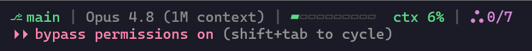

# Claude Statusline

> [中文](README.zh-CN.md) | English

A polished status line for Claude Code — **git branch · model · live context % with a color-coded bar · running subagent count** — plus auto-compact at 50 % and a session-start health check that survives CC updates.


## 🖥️ Demo



The single line at the bottom of your Claude Code terminal — git branch · model · context % with a color-coded bar · running subagents:

| Segment | Meaning |
|---|---|
| `⎇ main` | current git branch (`*` when dirty) |
| `Opus 4.8` | active model |
| `▰▰▰▰▱▱▱▱▱▱  ctx 42%` | context fill — bar turns **yellow ≥ 40 %**, **red ≥ 50 %** (auto-compact kicks in) |
| `◬ 1/3` | running subagents — **1 in this session / 3 across all sessions** (recursive over workflow subagents) |

## ✨ Features

- **One-line status line** — git branch (±dirty) · model · context % with a 10-cell color-coded bar · running subagents (this session / global, recursive over workflow subagents)
- **Auto-compact at 50 %** — compacts context at 50 % instead of the default ~80 %, so you keep more room to work
- **Session-start health check** — a fast hook verifies your config on every session start; flags regressions from CC updates or cc-switch profile switches before they bite
- **cc-switch safe** — propagates env vars + status line into every profile, so switching profiles no longer wipes your setup
- **Portable** — no hardcoded paths; honors `CLAUDE_CONFIG_DIR`
- **Zero dependencies** — pure Python 3.10+ standard library, no `pip install`

## 📦 Installation

### Option A — plugin (recommended)

Auto health-check hook, `/claude-statusline:install|healthcheck|restore` commands, and `/plugin update` for upgrades.

```
/plugin marketplace add Lxcardoza993/Claude-statusline
/plugin install claude-statusline@claude-statusline-market
/claude-statusline:install
```

Then **restart Claude Code**. The SessionStart hook auto-activates on install — it is **not** written into your `settings.json`, so cc-switch profile switches can't wipe it (unlike env vars, which would be).

### Option B — one-shot bash (fallback)

No plugin, no commands — just wires `settings.json` + copies `statusline.py`. Good for locked-down machines or when you don't want a plugin.

```bash
curl -fsSL https://raw.githubusercontent.com/Lxcardoza993/Claude-statusline/main/install.sh | bash
```

Then **restart Claude Code**. Re-run the same command to update later.

## ⚙️ What it configures

| Customization | Where | Effect |
|---|---|---|
| `statusLine` | `~/.claude/settings.json` | `python3 ~/.claude/statusline.py` renders the line |
| `CLAUDE_AUTOCOMPACT_PCT_OVERRIDE=50` | `env` | auto-compact at 50 % context |
| `CLAUDE_CODE_AUTO_COMPACT_WINDOW=300000` | `env` | compaction window |
| `autoCompactEnabled=true` | top-level | enables auto-compact |
| SessionStart hook | plugin | fast health check on every session start |

## 🔄 cc-switch compatibility

[cc-switch](https://github.com/farion1231/cc-switch) stores profiles as full `settings.json` snapshots in `~/.claude/profiles/*.json` that overwrite `~/.claude/settings.json` on switch. The installer detects this and propagates env vars + `statusLine` into **every** profile, so switching profiles no longer wipes your customizations.

## 🩺 After a Claude Code update

CC updates can rename env vars or move the binary. The SessionStart hook catches this automatically and surfaces a warning. To run the full check manually:

```
/claude-statusline:healthcheck
```

If a check fails, `/claude-statusline:install` (or re-run `install.sh`) repairs it. The installer is idempotent and backs up each edited file to `<file>.bak` on first edit.

## 📁 Project structure

```
.claude-plugin/marketplace.json      # marketplace manifest (repo root = marketplace)
claude-statusline/                   # the plugin
  .claude-plugin/plugin.json         # plugin manifest
  hooks/hooks.json                   # SessionStart → healthcheck.py --hook
  commands/{install,healthcheck,restore}.md
  scripts/{statusline,install,healthcheck}.py
install.sh                           # non-plugin one-shot installer
```

## 🤝 Acknowledgments

- **[OpenClaw 中文社区](https://github.com/OpenClaw)** — the Chinese-language community around Claude Code / OpenClaw and agentic tooling. Discussions there on hook mechanics, `${CLAUDE_PLUGIN_ROOT}` inline substitution, and plugin packaging directly shaped this project's design. 🙏
- **[Linux.do](https://linux.do)** — the Chinese developer community where many of the WSL2, proxy-networking, and Claude Code config-preservation practices behind this repo were shared and refined. 🙏

## 📄 License

MIT — see [LICENSE](LICENSE).
